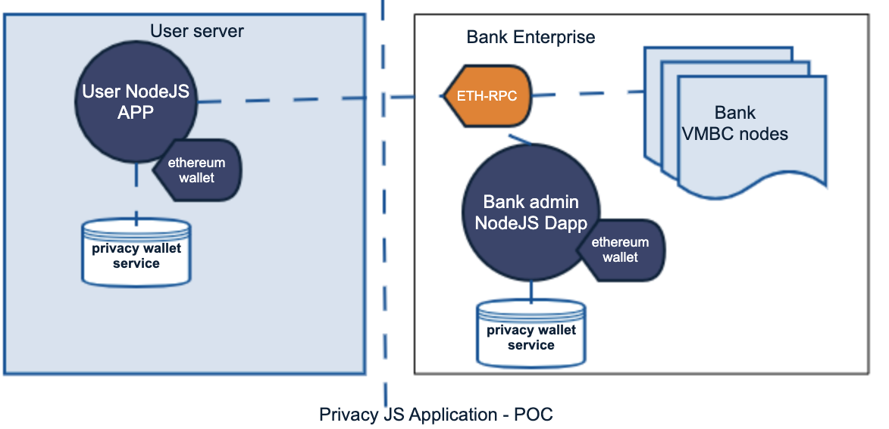
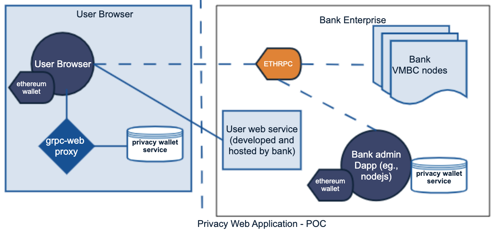

# VMware Privacy Javascript based DAPP reorganization

# Problem statement
Our initial release of privacy SDK only supported a C++ CLI application that users can try out to explore the privacy design aspects and workflow. This was not a developer friendly!

This is the first attempt for a developer friendly privacy application SDK. This document is scoped for "internal" developers and intended to capture all the crumbs to navigate the weird organization mainly intended to not break the current demo POC application!

## Reference:
- [Workgroup notes](https://confluence.eng.vmware.com/display/BLOC/VMBC+workgroup+-+UTT+privacy+feature+workgroup+notes)
- [ Design scratch draft](https://confluence.eng.vmware.com/display/~balakrishnas/Privacy+SDK+reorganization)
- [PM reference](https://confluence.eng.vmware.com/display/~uprabhu/Private+Token+Transfer)

# Overview
The primary candidate at core of the organization is [Privacy Library](./privacy-lib). This library is the SDK element that abstracts UTT privacy library details and provides simple javascript API to develop Dapp.
There are currently two proof of concept DAPP.
## Node-JS based DAPP

### NODEJS App overview
From development perspective the primary SDK consumption is the privacy wallet library. The internal organization on athena repository is structured fro 3 DAPP

| DAPP  | Remark | Location | Docker File | 
| ------------- | ------------- | ------------- |------------- |
| Node Administrator DAPP  | NodeJS based administrator DAPP  | [Admin-Node-DAPP](./admin-dapp) | [DockerfileAdminDApp](./../../docker/DockerfileAdminDApp) |
| Node User DAPP  | NodeJS based user DAPP  | [User-Node-DAPP](./user-dapp/privacy-user-dapp.js) | [DockerfileUserDApp](./../../docker/DockerfileUserDApp) |
| Privacy wallet service | utt wallet | [Privacy wallet service](https://github.com/vmware/concord-bft/tree/master/utt/privacy-wallet-service) | [DockerfilePrivacyService](./../../docker/DockerfilePrivacyService) |

The companion **privacy wallet service** is essentially the UTT(C++) service that aids with supporting UTT. All the DAPP inturn use this service as backend. The source code of this service is under github open source library. 

[Privacy wallet service](https://github.com/vmware/concord-bft/tree/master/utt/privacy-wallet-service)
This is a GRPC server in essence and the IDL is specified under [wallet-api.proto](https://github.com/vmware/concord-bft/blob/master/utt/privacy-wallet-service/proto/api/v1/wallet-api.proto).
Docker file - [DockerfilePrivacyService](./../../docker/DockerfilePrivacyService).

The smart contract is shared and mostly the same as original version. 

#### Platform
The entire development was performed using docker containers and native builds under X86_64 ubuntu 18.04 platform. 

#### How to test with containers

### Pre-requisite: VMBC platform
Deploy an VMBC platform and bring up clientservice and ethRpc in addition. [Reference](https://gitlab.eng.vmware.com/blockchain/vmwathena_blockchain/-/tree/master/privacy-demo#setup-ethereum-vmbc-and-test-that-you-have-a-working-cluster).

### *Build all APP docker images!*
Build all required DAPP, privacy service etc., container images. Refer to or leverage the build scripts
[Reference script to build the container images](./scripts/0-build-privacy-dapp-images.sh)

### Docker container ONLY (non-docker compose) sequence:
For development or quick testing purpose you can spawn an standalone container. Refer to [StandaloneContainerReadme.md](./scripts/StandaloneContainerReadme.md) 

### Docker compose sequence:
The current docker compose files for user-Dapp is preset to 3 users. It can be extended as required. The K8S deployment must be very flexible and scalable.

| APP | compose file |
|------|-------------|
|docker-compose-privacy-admin-dapp.yml| [docker-compose-privacy-admin-dapp.yml](./../../docker/docker-compose-privacy-admin-dapp.yml) |
|docker-compose-privacy-user-dapp.yml| [docker-compose-privacy-user-dapp.yml](./../../docker/docker-compose-privacy-user-dapp.yml) |

```
docker-compose -f docker-compose-privacy-admin-dapp.yml -f docker-compose-privacy-user-dapp.yml up -d
```

## Browser WEB-JS based DAPP

### Draft(WIP) [WEB Browser App overview](https://confluence.eng.vmware.com/display/BLOC/VMBC+workgroup+-+UTT+privacy+feature+workgroup+notes)
### Overview
The browser app was intended to demonstrate the ability to prototype a web application. We leverage [GRPC-WEB](https://grpc.io/docs/platforms/web/basics/) and Envoy proxy to support browser to privacy wallet service integration.

| Application  | Remark | Location | Docker File | 
| ------------- | ------------- | ------------- |------------- |
| Envoy GRPC proxy  | grpc-web proxy  | [proxy-file](./user-web-dapp/envoy.yaml) | [DockerfileEnvoy](./../../docker/DockerfileEnvoy) |
| Web User DAPP  | Browser based user DAPP  | [User-Browser-DAPP](./user-web-dapp/web_client_app.js) | N/A hosted on web server |
| Privacy wallet service | utt wallet | [Privacy wallet service](https://github.com/vmware/concord-bft/tree/master/utt/privacy-wallet-service) | [DockerfilePrivacyService](./../../docker/DockerfilePrivacyService) |

### TODO: add steps to bring up browser APP

1. Bring up envoy proxy:
```
docker run -it --rm --env-file vmwathena_blockchain/privacy-demo/docker/.env --network host --name envoy envoy:latest
```
2. Bring up privacy service wallet container.
Hack: For now expose it on host so the browser on host can talk to it..
```
docker run -d --rm --env-file vmwathena_blockchain/privacy-demo/docker/.env --mount source=charlie,target=/app/wallet-db --network host --name utt-wallet privacy-service:latest
```

3. Webpack and start web server
```
cd vmwathena_blockchain/privacy-demo/web3/privacy-dapp/privacy-lib
npm install

cd vmwathena_blockchain/privacy-demo/web3/privacy-dapp/user-web-dapp
npm install
npx webpack

Start http server:
python -m http.server 8081
```
